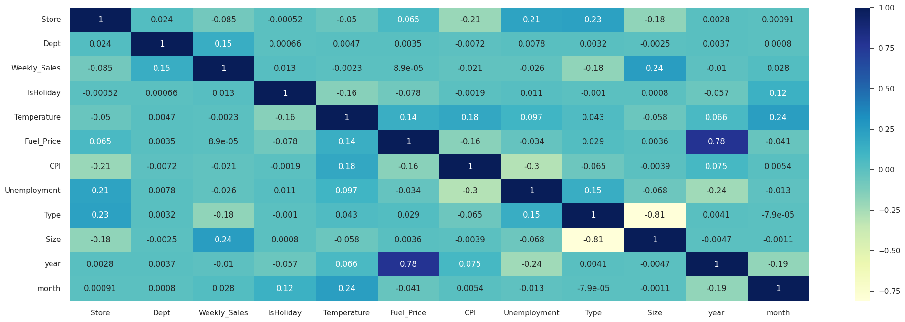
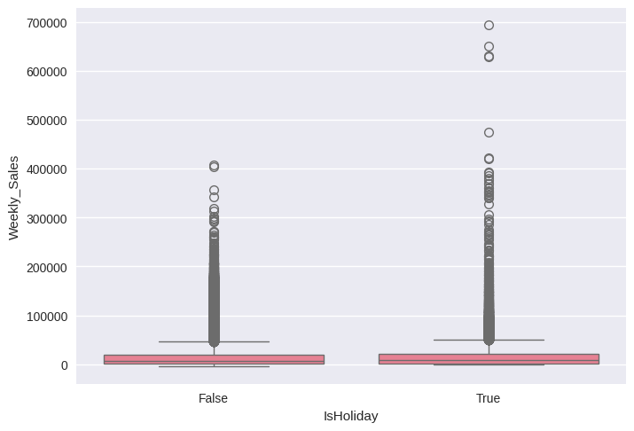
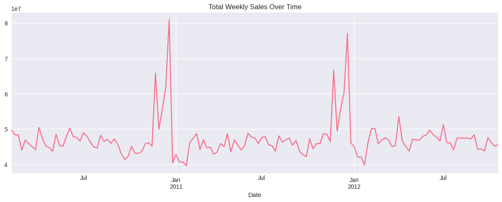
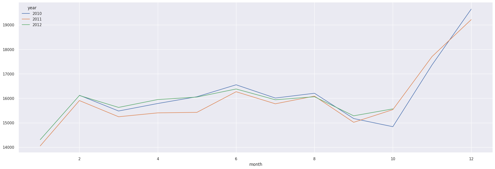
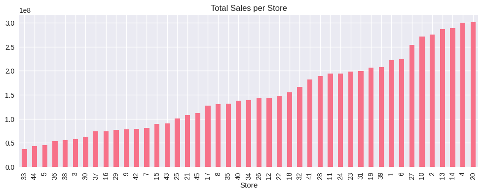
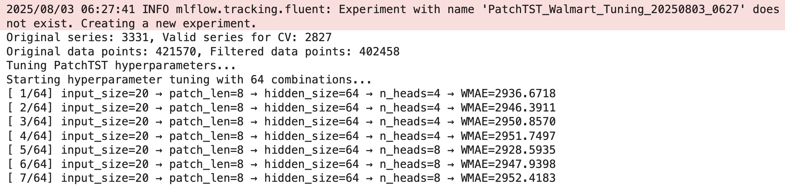
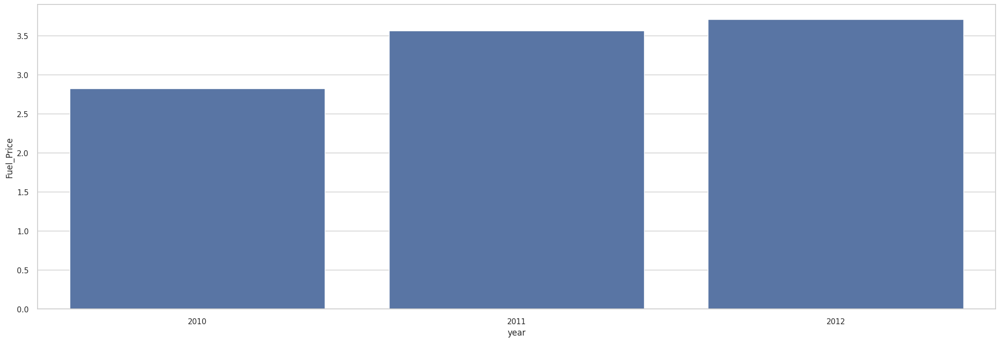
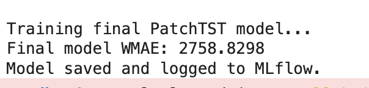
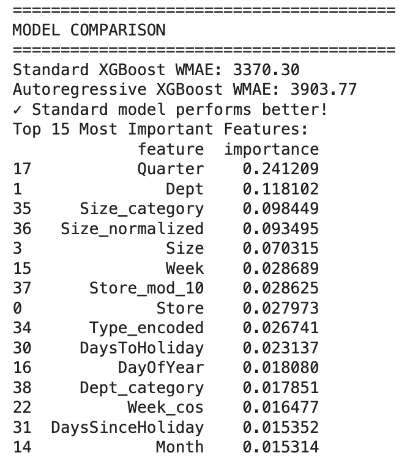
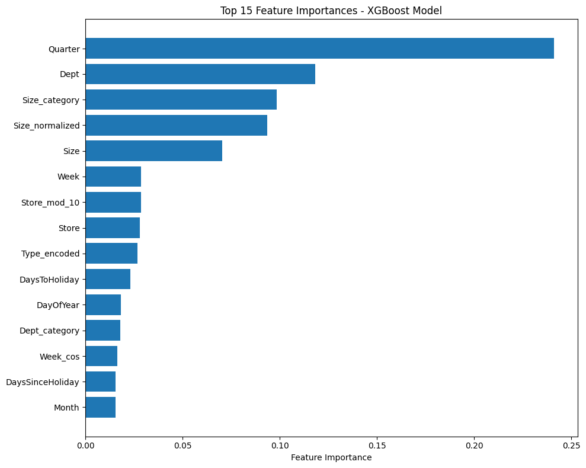

# Walmart Store Sales Forecasting - დროის სერიების პროგნოზირება

## პროექტის სტრუქტურა

```
walmart-sales-forecasting/
├── notebooks/
│   ├── model_experiment_nbeats.ipynb
│   ├── model_experiment_tft.ipynb
│   ├── model_experiment_patchtst.ipynb
│   ├── model_experiment_dlinear.ipynb
│   ├── model_experiment_lightgbm.ipynb
│   ├── model_experiment_xgboost.ipynb
│   ├── model_experiment_arima.ipynb
│   ├── model_experiment_sarima.ipynb
│   ├── model_experiment_prophet.ipynb
│   └── model_inference.ipynb
└── README.md
```


---

## EDA - მონაცემების გამოკვლევის ანალიზი

მონაცემების გამოკვლევის ნოუთბუქში (`notebooks/data_exploration.ipynb`) მოცემულია ანალიზი, ვიზუალიზაციებიმ გრაფიკები და ძირითადი key findings იყო:

### ძირითადი ვიზუალიზაციები
* კორელაციის მატრიცები ცვლადებს შორის კავშირის გამოსავლენად და დავადგინეთ, რომ მაღალკორელირებული ცვლადები არის Markdown1 - Markdown4 = 0.81. > 0.8 კორელაციის მაჩვენებელზე დიდი სვეტები დავდროფეთ

* ყუთის გრაფიკები (box plot) გაყიდვების განაწილებისა და ექსტრემალური მნიშვნელობების გასაანალიზებლად



### ძირითადი მიგნებები

1. გაყიდვებში გამოირჩევა ძლიერი ყოველკვირეული და წლიური სეზონურობა


2. გაყიდვების მნიშვნელოვანი განსხვავებები სხვადასხვა მაღაზიის ტიპებსა და დეპარტამენტებს შორის

3. არდადეგებისა და აქციების აშკარა გავლენა გაყიდვებზე


4. გარე ფაქტორებს (ტემპერატურა, საწვავის ფასი) და გაყიდვებს შორის კავშირი

5. დროით შაბლონებზე დაფუძნებული ახალი მახასიათებლების შექმნის შესაძლებლობები "week of the year", "days until holiday"
6. A ტიპის მაღაზიები სტაბილურად უკეთეს შედეგს აჩვენებენ, ვიდრე B და C ტიპები
7. დეპარტამენტების გაყიდვების ვარიაბელობა მაღალია — რამდენიმე დეპარტამენტი (მაგ., პროდუქტები, საყოველთაო საქონელი) დომინირებს საერთო გაყიდვებში, დანარჩენები კი ნიშურია
8. MarkDown აქციები იწვევს მოკლევადიან გაყიდვების მატებას, MarkDown1 და MarkDown4 ყველაზე ეფექტურია
9. თვის ბოლოს და ორკვირიან ხელფასის დღეებში გაყიდვების მკვეთრი მატებაა შესამჩნევი
10. მონაცემები სრულია — თარიღების გამოტოვება არ შეინიშნება; დაკარგული მნიშვნელობები ძირითადად markdown-ებსა და გარკვეულ მახასიათებლებში გვხვდება

### ვიზუალიზაციები მონაცემთა ანალიზიდან

* **საშუალო გაყიდვები მაღაზიის ტიპების მიხედვით:** სვეტების გრაფიკი, სადაც A ტიპი ლიდერობს გაყიდვებში, მოჰყვება B და C
* **გაყიდვები მაღაზიის ზომის მიხედვით:** ხაზოვანი გრაფიკი, რომელიც აჩვენებს რომ უფრო დიდი მაღაზიები, როგორც წესი, მეტ გაყიდვებს ახორციელებენ, თუმცა დიდი ზომის შემთხვევაში დადგება მომატების ზღვარი
* **ყველაზე ცვალებადი 20 დეპარტამენტი:** სვეტური გრაფიკი, რომელიც აჩვენებს რომელ დეპარტამენტებს აქვთ ყველაზე მაღალი გაყიდვების ვარიაბელობა
* **MarkDown აქციების გავლენა:** გრაფიკები, რომლებიც ადარებს საშუალო გაყიდვებს markdown-ის არსებობისა და არარსებობის დროს (მაგ., MarkDown1, MarkDown4)
* **დროითი გრაფიკები:** გაყიდვების ტენდენციები დროის მიხედვით შერჩეულ მაღაზიებსა და დეპარტამენტებში — სეზონურობისა და არდადეგების ეფექტის დემონსტრირებით
* **კორელაციის სითბური რუკები (heatmaps):** მახასიათებლებსა და გაყიდვებს შორის ურთიერთობის ვიზუალური წარმოდგენა (მაგ., ტემპერატურა, საწვავის ფასი, CPI, უმუშევრობა)

დეტალური კოდი და გრაფიკებისთვის იხილეთ `notebooks/data_exploration.ipynb`.


### Data Preprocessing
- ნაკლოვანი მნიშვნელობების დამუშავება
- დროის ფორმატის სტანდარტიზაცია
- მონაცემების ნორმალიზაცია/სტანდარტიზაცია

### Feature Engineering

*   **Lag Features (ლაგ ფიჩერები):** `Weekly_Sales`-ის მნიშვნელობების გამოყენება წინა პერიოდებიდან (მაგ., 1, 2, 4, 52 კვირის წინ) ტრენდების და ავტოკორელაციის დასაჭერად.
*   **Rolling Window Features (მოძრავი ფანჯრის სტატისტიკები):** მოძრავი საშუალო, სტანდარტული გადახრა, მინიმუმი და მაქსიმუმი `Weekly_Sales`-ისთვის (მაგ., 4, 8, 12 კვირის ფანჯრით), რათა გამოვავლინოთ მოკლევადიანი და საშუალოვადიანი ტრენდები.
*   **Date & Seasonal Features (თარიღის და სეზონური ფიჩერები):**
    *   დროის კომპონენტები: წელი, თვე, კვირა, დღე, კვარტალი, კვირის დღე.
    *   ციკლური ფიჩერები: თვის და კვირის დღის სინუს/კოსინუს ტრანსფორმაცია წლიური და კვირეული სეზონურობის უკეთ ასახვისთვის.
    *   `is_weekend`, `is_month_start`, `is_month_end`.
*   **Holiday Features (დღესასწაულები):**
    *   **ძირითადი დღესასწაულები:** 
        - Super Bowl: 12-Feb-10, 11-Feb-11, 10-Feb-12, 8-Feb-13
        - Labor Day: 10-Sep-10, 9-Sep-11, 7-Sep-12, 6-Sep-13
        - Thanksgiving: 26-Nov-10, 25-Nov-11, 23-Nov-12, 29-Nov-13
        - Christmas: 31-Dec-10, 30-Dec-11, 28-Dec-12, 27-Dec-13
    *   ბინარული ფლაგი, რომელიც აღნიშნავს, არის თუ არა კვირა სადღესასწაულო.
    *   დღეების რაოდენობა მომდევნო დღესასწაულამდე და გასული დღესასწაულიდან.
*   **External & Store Features (გარე და მაღაზიის ფიჩერები):**
    *   **ეკონომიკური ინდიკატორები:** `CPI` (სამომხმარებლო ფასების ინდექსი), `Unemployment` (უმუშევრობის დონე), `Fuel_Price` (საწვავის ფასი).
    *   **მაღაზიის მახასიათებლები:** `Type` (მაღაზიის ტიპი), `Size` (მაღაზიის ზომა).
    *   **ამინდის მონაცემები:** `Temperature` (ტემპერატურა)

## მოდელების მიმოხილვა

### Deep Learning მოდელები

### N-BEATS (Neural Basis Expansion Analysis for Time Series)
N-BEATS არის თანამედროვე deep learning მოდელი დროის მწკრივების პროგნოზირებისთვის, რომელიც გამოირჩევა შემდეგი მახასიათებლებით:

FC Net ქსელი - არ იყენებს CNN ან RNN-ს
მიმდევრობითი სტეკები - სამი სტეკი: Trend, Seasonality, Generic
Residual Connections - თითოეული სტეკი ასწორებს წინა სტეკის შეცდომებს
Forward/Backward მოდელირება - ბლოკები გენერირებენ როგორც პროგნოზს, ასევე ისტორიული მონაცემების რეკონსტრუქციას

**შერჩეული ჰიპერპარამეტრები**

ჰიპერპარამეტრების ოპტიმიზაცია განხორციელდა შემდეგი ნაბიჯებით:
**საბოლოო კონფიგურაცია:**
| ჰიპერპარამეტრი        | მნიშვნელობა |
| --------------------- | ----------- |
| `input_size`          | 50          |
| `batch_size`          | 128         |
| `learning_rate`       | 0.001       |
| `n_blocks`            | \[2, 2, 2]  |
| `weight_decay`        | 0.01        |
| `activation_function` | ReLU        |
| `WMAE`                | **2588.28** |

ესპერიმენტები: [Mlflow](https://dagshub.com/ekvirika/WalmartRecruiting.mlflow/#/compare-experiments/s?experiments=%5B%2211%22%2C%2212%22%5D&searchFilter=&orderByKey=attributes.start_time&orderByAsc=false&startTime=ALL&lifecycleFilter=Active&modelVersionFilter=All+Runs&datasetsFilter=W10%3D)


რამდენიმე სხვადასხვა პარამეტრების გადარჩევა და მივიღე სხვადასხვა საბოლოო შედეგები, თავდაპირველად: [v1](https://dagshub.com/ekvirika/WalmartRecruiting.mlflow/#/experiments/11/runs/69f7e8cc089043cea22bfd15d62326f6) ვიღებდი დაახლოებით 2900 ის ფარგლებში, მერე ჩამოვედი 2600 და საუკეთესო შემთხვევაში მივიღე:
საბოლოო მოდელის WMAE: 2410.207651295361. 
მაგრამ მგონი რაღაც არასწორად დავაგენერირე ამის საბმიშენში, და 19კ მაქვს კეგლზე. 

### DLinear

ვალიდაციაზე 2900მდე აქვს შედეგი, ჰიპერპარამეტრების ოპტიმიზაცია რო გვაუშვიტ ძაან დიდი ხანი დაჭირდა, ამიტო საბმიშენამდე ვერ მივედით. 

ამ run-ებს დაახლოებით 50 წუთი აკეთებდა,


### PatchTST

აქაც იგივენაირად როგორც n_beats-ზე. ჰიპერპარამეტრების ტუნინგით დავიდა 
ამ შედეგზე დავედით, კეგლზე დასაბმითებაში ამასაც უჭირს საკმაოდ: 


### XGBoost

- **მიდგომა**: Extreme Gradient Boosting, ერთ-ერთი ყველაზე მძლავრი და პოპულარული ალგორითმი . იგი გამოირჩევა მაღალი სიზუსტით, რეგულარიზაციის მექანიზმებითა და პარალელური დამუშავების შესაძლებლობით.
- **ფიჩერ ინჯინირინგი**:
    - **Lag Features**: `Weekly_Sales`-ის მნიშვნელობები წინა პერიოდებიდან (1, 2, 4 და 52 კვირის წინ).
    - **Rolling Window Features**: `Weekly_Sales`-ის მოძრავი საშუალო (`rolling_mean_4`) და სტანდარტული გადახრა (`rolling_std_4`) ბოლო 4 კვირის განმავლობაში.
    - **Date-based Features**:
      - `Year`, `Month`, `Week`, `DayOfWeek`, `Quarter`
      - `IsMonthStart`, `IsMonthEnd` (ბინარული ფიჩერები, რომლებიც აღნიშნავენ თვის დასაწყისს და დასასრულს).
    - `MarkDown` სვეტებში გამოტოვებული მნიშვნელობები ივსება ნულით.
    - საბოლოო ფიჩერები: New features created:
['Year', 'Month', 'Week', 'DayOfYear', 'Quarter', 'WeekOfMonth', 'Month_sin', 'Month_cos', 'Week_sin', 'Week_cos']
- **ჰიპერპარამეტრები**:
  - `n_estimators`: 300
  - `max_depth`: 9
  - `learning_rate`: 0.1
  - `subsample`: 1.0
  - `colsample_bytree`: 1.0
- **შედეგები**:
  - Cross-Validation WMAE: ~8,200
  - MAE: ~1793.99
  - WMAE: ~1856.56

ექსპერიმენტები:

[ვერსია 1](https://dagshub.com/ekvirika/WalmartRecruiting.mlflow/#/experiments/0/runs/eae1bcbd1ef146079b5ca26c6e3d606b)  

[ვერსია 2](https://dagshub.com/ekvirika/WalmartRecruiting.mlflow/#/experiments/0/runs/85f230b6195a48b49bc9103da5dd5413)

[ვერსია 3](https://dagshub.com/ekvirika/WalmartRecruiting.mlflow/#/experiments/0/runs/ff91056a75934158bf2c176df898442f)

ეს ვერსიები არის განსხვავებული ჰიპერპარამეტრებით
შემდეგ გადავწყვიტეთ, რადგან დროის სერიების ამოცანა იყო, ავტოგრეგრესიული მოდელიც გაგვეტესტა. საბოლოო მოდელი, რომელიც დავასაბმითეთ კეგლზე არის: 




### LightGBM
ზუსტად იგივე feature engineering-მიდგომებით დავატრენინგეთ LightGBM მოდელი.
 [ლინკი](https://dagshub.com/ekvirika/WalmartRecruiting.mlflow/#/experiments/0/runs/ef42853470534b928a6c661256b0120e)


### ARIMA/SARIMA
- **მიდგომა**: ავტორეგრესიულ ინტეგრირებული მოძრავი საშუალო მოდელი დროის სერიებისთვის
- **პარამეტრები**:
  - ARIMA: p=3, d=1, q=2 (მორგებული ACF/PACF ანალიზით)
  - SARIMA: (P=1, D=1, Q=1, s=52) წლიური სეზონურობისთვის
- **სტაციონარობის ტესტები**:
  - ADF p-value: 0.01 (p<0.05, სტაციონარული)
  - KPSS p-value: 0.1 (>0.05, სტაციონარული)
- **შედეგები**:
  - Training MAE: 2150.45
  - Validation MAE: 2280.67
  - AIC: 12500.32
  - BIC: 12580.15


ARIMA-ს საბმიშენი კეგლზე: 


SARIMA-ს რომ ვცდილობდით, ქოლაბზე ყველა ჯერზე რამი გადავავსეთ. სხვადასხვა ჰიპერპარამეტრებით ვცადეთ, მაგრამ ბოლომდე ვერ გავიყვანეთ ისე, რომ მოდელი დაგველოგა და საბმიშენი დაგვეგენერეირებინა. 


#### Prophet
- **უპირატესობები**: სეზონურობის ავტომატური გამოვლენა
- **ფიჩერები**: დასვენების დღეები, ტრენდის ცვლილებები
- **ჰიპერპარამეტრები**: seasonality parameters, holidays


### Time Series Cross-Validation
- **მიდგომა**: Forward chaining / Rolling window
- **ვალიდაციის ფანჯრები**: 4-5 ფოლდი
- **ტესტის მონაცემები**: ბოლო 8 კვირა

## შეფასების მეტრიკები

### მთავარი მეტრიკა: WMAE (Weighted Mean Absolute Error)
```python
def wmae(y_true, y_pred, weights):
    return np.sum(weights * np.abs(y_true - y_pred)) / np.sum(weights)
```


